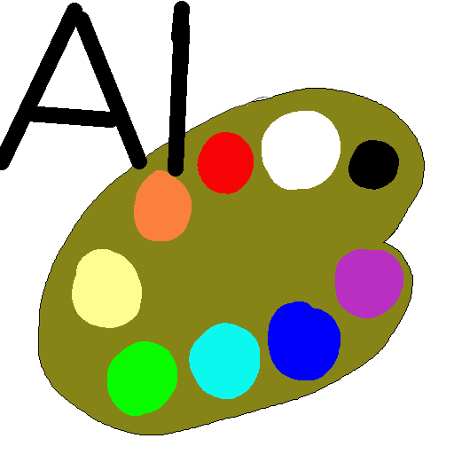
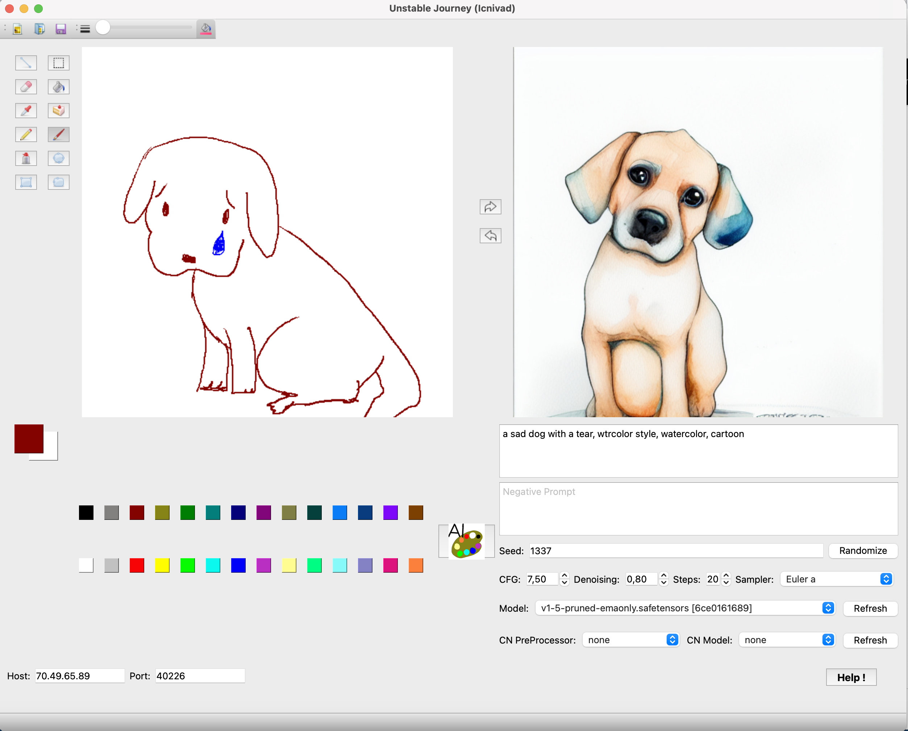

# Unstable Journey (codename Icnivad)

A desktop Paint application, with basic Tablet support, powered by Stable Diffusion, automatic1111 webui and PieCasso!



Express yourself with Unstable Journey, the only drawing application to feature
ready to make pictures of pie, with AI!



## Dependencies

First, you need to have [AUTOMATIC1111 webui installed and running](https://github.com/AUTOMATIC1111/stable-diffusion-webui/wiki/Install-and-Run-on-NVidia-GPUs).

Second, you need to modify webui-user.bat (Windows) or .sh (Linux) in the AUTOMATIC1111 webui install folder to add the **--api** [COMMANDLINE_ARGS, as explained here](https://github.com/AUTOMATIC1111/stable-diffusion-webui/wiki/Command-Line-Arguments-and-Settings#webui-user). Optional: You can also add the **--listen** argument if you'll connect to another computer/server hosting the webui instad of using localhost:7860

Third, you need to have **git** and **python 3** installed (haven't tested other versions).

## Install

```
git clone https://github.com/rulyone/unstable_journey.git
cd unstable_journey
pip3 install -r requirements.txt
```

If everything is success, you should be able to run it:

```
python3 unstable_journey.py
```

## Troubleshooting and Questions

Join the Discord server if you would like to contribute or have any questions

https://discord.gg/9wKuxN7aaq